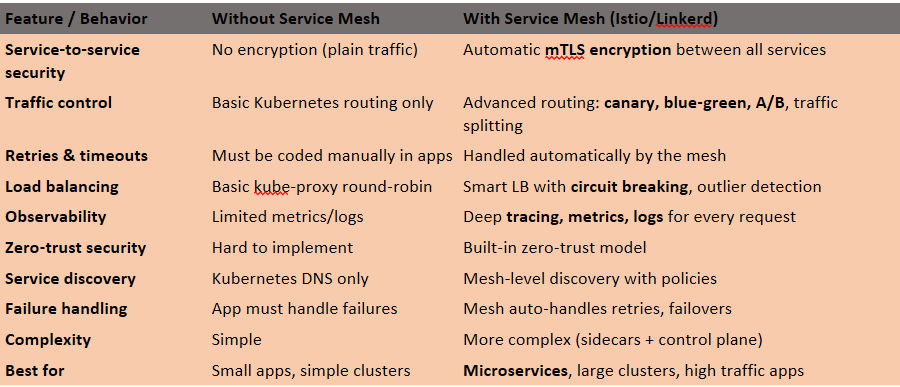

Service Mesh:: 
   To understand Service Mesh, you must first understand Kubernetes architecture, how pods communicate, and why Kubernetes was introduced — mainly to orchestrate containers, scale workloads, and manage               distributed systems.
    But Kubernetes does NOT solve secure, reliable, observable service‑to‑service communication.
    That’s where Service Mesh comes in.!!!!

The first point is why this service mesh came into the picture ? 

In real production microservices, teams started facing massive communication problems as the number of services grew. Kubernetes could schedule pods, but it could not secure or control the traffic between them. Pod‑to‑pod calls were unencrypted, unauthenticated, and impossible to monitor deeply. Developers were forced to write TLS, retries, timeouts, and circuit‑breaking logic inside every service, creating inconsistent behavior and huge operational overhead. Deployments became risky because there was no native way to do canary, blue/green, or traffic shifting. Debugging failures was painful due to missing metrics, tracing, and per‑route visibility. As microservices scaled, one slow or failing service could trigger cascading failures across the system. To solve all these real‑world issues, Service Mesh introduced a dedicated data plane (sidecar proxies) and control plane to handle mTLS, identity, traffic control, observability, and reliability **outside the application code**, giving teams a consistent, secure, and production‑ready communication layer.

    Data Plane:: Data Plane is the actual traffic handler, It sits next to every pod and controls all incoming/outgoing requests.
         ex: When Service A calls Service B → sidecar proxy handles the call, not the app.

    Control Plane:: Control Plane is the central manager that configures all sidecars.
         ex: You change a traffic rule → Control Plane sends it to all sidecars.

Without Service Mesh🟤🟤
- No Identity → services can’t verify each other  
- No mTLS → traffic unencrypted  
- No Zero‑Trust → lateral movement risk  
- No Retries/Timeouts → app must handle everything  
- No Circuit Breaking → failures cascade  
- No Traffic Control → no canary, no blue/green  
- No Internal Encryption → vulnerable pod‑to‑pod traffic  

With Service Mesh😶‍🌫️
- mTLS Everywhere → encrypted pod‑to‑pod traffic (sidecar proxy)  
- Service Identity → each service gets its own certificate  
- Zero‑Trust → every request verified  
- Sidecar Security → proxy enforces policies, not the app  
- Traffic Control → canary, blue/green, traffic split  
- Auto‑Retries → built‑in reliability  
- **Policy Enforcement** → fine‑grained service control  
- **No Code Changes** → all features without modifying apps  

 It injects a tiny Rust-based proxy into each pod, and this proxy handles encryption, routing, retries, and health checks

• Every pod gets a sidecar proxy. 
• Proxy handles mTLS, retries, timeouts, load balancing
• Application container → talks to proxy → proxy talks to other proxies
• Control plane manages certificates and identity
• No app code changes required
No YAML changes required except enabling injection. 

     
