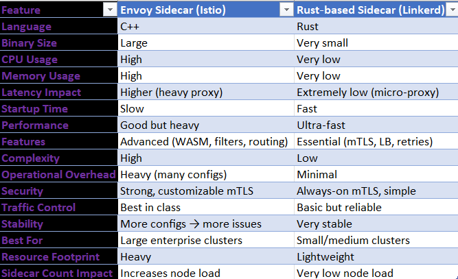

so now there are 2 dominant mesh: 
* Istio 
* linkerd  
         

# Istio — Production Reality**  
**What it is:**  
A full‑featured, enterprise service mesh built for **complex microservices**.

**Real Production Behavior:**  
- Uses Envoy sidecar → heavy but extremely powerful  
- Best for advanced traffic control (canary, A/B, blue‑green)  
- Deep observability (metrics, logs, tracing)  
- Strong security (mTLS, identity, policies)  
- Supports multi‑cluster, multi‑tenant, zero‑trust  
- Needs more CPU/RAM → not ideal for small clusters  
- Operationally complex → more moving parts (Pilot, Citadel, Galley, etc.)

  use case:
Large enterprises, high‑traffic apps, complex routing, strict security.

---

#  Linkerd — Production Reality
**What it is:**  
A simple, ultra‑light, ultra‑fast service mesh built for **performance and reliability**.

**Behavior:**  
- Uses Rust‑based micro‑proxy → extremely lightweight  
- Very low CPU/RAM usage → perfect for small/medium clusters  
- Simple install, simple operations  
- mTLS is on by default  
- Reliability features built‑in (retries, timeouts, LB)  
- Observability is clean but not as deep as Istio  
- Fewer features → but more stable and predictable

 use case:  
Teams who want speed, simplicity, low overhead, and production stability.

---

#  Istio vs Linkerd 

| Feature | **Istio** | **Linkerd** |
|--------|-----------|-------------|
| **Resource Usage** | High (Envoy heavy) | Very low (Rust proxy) |
| **Complexity** | High | Low |
| **Traffic Control** | Best in class | Basic but solid |
| **Security (mTLS)** | Strong, customizable | Always‑on, simple |
| **Observability** | Deep (Envoy + telemetry) | Clean, lighter |
| **Performance** | Slower (Envoy overhead) | Very fast |
| **Use Case** | Large enterprises | Small/medium clusters |
| **Learning Curve** | Steep | Easy |

---
the main diff b/w is 
| Envoy (Istio)      | Rust Proxy (Linkerd) 

| Heavy CPU/RAM      | Extremely lightweight 
| Adds latency       | Very low latency 
| Needs bigger nodes | Runs on small nodes easily 



Linkerd:: 

Linkerd Sidecar Flow

1. Each pod gets a tiny Rust proxy (sidecar).
2. App sends traffic → local sidecar.
3. Sidecar encrypts using mTLS.
4. Encrypted traffic → destination sidecar.
5. Destination sidecar decrypts → sends to app.


**App → Sidecar → Encrypted → Sidecar → App**

---

# ⭐ **What the Linkerd Sidecar Actually Does**
| Step | What Happens |
|------|--------------|
| **1. Encrypts** | Sidecar encrypts all outgoing traffic (mTLS). |
| **2. Sends to proxy** | Traffic goes to the **other pod’s sidecar**, not directly to the app. |
| **3. Decrypts** | Destination sidecar decrypts and forwards to the app. |

---

# ⭐ **Is it a central proxy?**
**❌ No.**  
Every pod has **its own** tiny proxy → that’s why it’s called **sidecar**, not gateway.

Got you, Furkhan — here is the **cleanest, tightest, production‑grade, no‑fluff condensation** of EVERYTHING you wrote.  
All sections rewritten into **short, sharp, structured blocks** you can directly paste into your docs.

---

# ⭐ **Pod Structure**

**Pod = App Container + Sidecar Proxy**

**Sidecar handles:**
- mTLS  
- Retries  
- Timeouts  
- Traffic routing  
- Observability  

---

# ⭐ **Traffic Flow**

**Service A App → Local Sidecar → (mTLS Encrypted) → Remote Sidecar → Service B App**

**Key Point:**  
**Apps never talk directly. Only proxies talk.**

---

# ⭐ **mTLS Flow**

**Service A Proxy → Verify Identity → Exchange Certs → Create Encrypted Tunnel → Service B Proxy**

- Certificates auto‑generated  
- Auto‑rotated  
- No manual TLS  
- Zero‑trust enforced  

---

# ⭐ **Sidecar Injection Flow**

**Deploy App → Namespace Injection Enabled → Mesh Auto‑Injects Sidecar → Pod Starts (App + Proxy)**

---

# ⭐ **Control Plane**

**Components:**
- Identity Service  
- Certificate Authority  
- Proxy Injector  
- Policy Controller  
- Destination Service  

**Functions:**
- Manage certificates  
- Inject proxies  
- Enforce policies  
- Service discovery  
- Routing rules  

---

# ⭐ **Data Plane**

**Data Plane = All Sidecar Proxies**

Handles:
- Encryption  
- Routing  
- Retries  
- Timeouts  
- Metrics  

**All live traffic flows through the data plane.**

---

# ⭐ **Observability Architecture**

```
        Linkerd
     ┌────┬────┐
     │    │    │
     ▼    ▼    ▼
Prom   Grafana   Loki
Metrics Dashboards Logs
```

---

# ⭐ **Canary Deployment**

Mesh Router:
- 90% → v1  
- 10% → v2  

Used for:
- Gradual rollout  
- Safe deployment  
- Testing new versions  

---

# ⭐ **Blue‑Green Deployment**

**Traffic Router → Blue or Green Environment**  
Instant switch between environments.

---

# ⭐ **Retry & Timeout Flow**

Request → Success → Return
Request → Failure → Auto‑Retry → Timeout if exceeded

**No app code needed.**

---

# ⭐ **Circuit Breaking**

Service Healthy?  
- Yes → Route traffic
- No → Stop traffic to bad pod 

Prevents cascading failures.

----------------------------------------------------------------------------------------------------------------

Install CLI
    │
    ▼
Install Control Plane   
    │
    ▼
Enable Namespace Injection
    │
    ▼
Restart Deployments
    │
    ▼
Sidecars Injected
    
    ▼
mTLS + Routing + Metrics Active

*Real Production Cons Flow*
More Features
      │
      ▼
More Complexity
      │
      ├── Higher RAM
      ├── Higher CPU
      ├── Harder Debugging
      ├── Certificate Issues
      ├── Upgrade Risks
      └── Increased Latency              ###  BUT IN THIS LINKERD IT IS MIN

Sidecar Injection  → how to enable it.

Option A: Enable for entire namespace

Option B: Enable for a single pod/deployment

 if you add this to a Deployment/Pod YAML, Linkerd will inject the sidecar into that pod.
 If you add it to the namespace, then ALL pods in that namespace get the sidecar automatically.
 If you do NOT add it, nothing happens — no sidecar, no Linkerd.